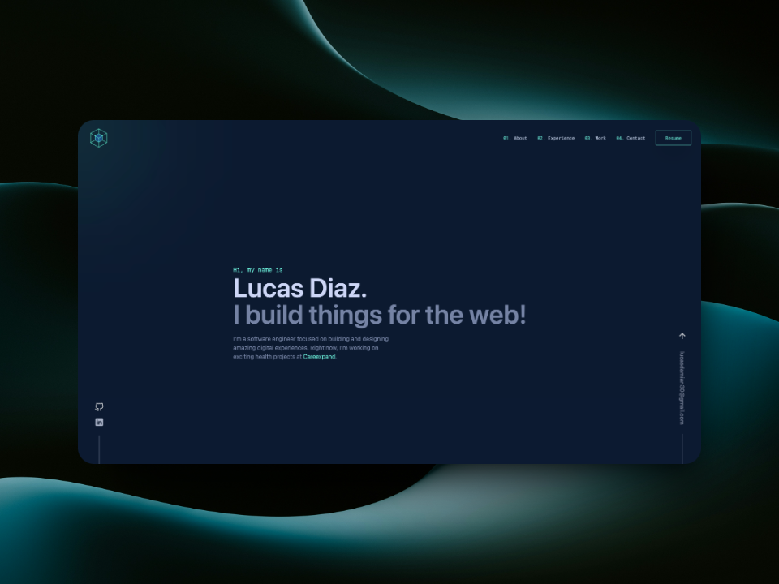

# Portfolio Website

A modern, responsive portfolio website built with React, TypeScript, and Vite, featuring smooth animations and an elegant design.

🌐 [View Live Demo](https://lucasdiaz.site/)



## 🌟 Features

-   Responsive design that works on all devices
-   Smooth scroll animations using Framer Motion
-   Interactive cursor effects with custom firefly animation
-   Dynamic project showcases
-   Dark theme with custom color palette
-   Optimized performance
-   TypeScript for type safety
-   Modular component architecture

## 🛠️ Built With

-   React 18
-   TypeScript
-   Vite
-   Framer Motion
-   Tailwind CSS
-   SASS
-   React Router DOM

## 🚀 Getting Started

### Prerequisites

-   Node.js (v18 or higher)
-   npm or yarn

### Installation

1. Clone the repository

```bash
git clone https://github.com/yourusername/portfolio.git
```

2. Install dependencies

```bash
cd portfolio
npm install
```

3. Start the development server

```bash
npm run dev
```

4. Build for production

```bash
npm run build
```

## 📁 Project Structure

```
src/
├── components/     # Reusable React components
│   ├── AboutMe.tsx
│   ├── Footer.tsx
│   ├── Laterals.tsx
│   ├── OtherNoteworthyProjects.tsx
│   ├── SelfIntroduction.tsx
│   ├── SomeThingIBuild.tsx
│   ├── TopMenu.tsx
│   ├── WhatsNext.tsx
│   └── WhereIWorked.tsx
├── pages/         # Page components
│   └── Home.tsx
├── styles/        # Global styles and SASS files
│   ├── Components.scss
│   └── Home.scss
├── App.tsx        # Main application component
└── main.tsx       # Application entry point
```

## 🎨 Key Components

-   `TopMenu`: Navigation bar with responsive mobile menu and smooth scroll functionality
-   `SelfIntroduction`: Hero section with personal introduction and animations
-   `AboutMe`: Personal background and skills section with staggered animations
-   `WhereIWorked`: Interactive work experience timeline
-   `SomeThingIBuild`: Featured projects showcase with motion effects
-   `WhatsNext`: Contact section with call-to-action
-   `Laterals`: Fixed side elements with social links and email
-   `Footer`: Site footer with credits

## 🔧 Configuration Files

### TypeScript Configuration

The project uses a split TypeScript configuration for better organization:

-   `tsconfig.json`: Base configuration
-   `tsconfig.app.json`: Application-specific settings
-   `tsconfig.node.json`: Node.js environment settings

### Vite Configuration

```javascript
// vite.config.ts
export default defineConfig({
	plugins: [react()],
});
```

### Tailwind CSS Configuration

```javascript
// tailwind.config.js
export default {
	content: ["./index.html", "./src/**/*.{js,ts,jsx,tsx}"],
	theme: {
		extend: {
			keyframes: {
				firefly: {
					"0%, 100%": { transform: "scale(0.8)", opacity: "0.7" },
					"50%": { transform: "scale(1.2)", opacity: "1" },
				},
			},
			animation: {
				firefly: "firefly 1.5s ease-in-out infinite",
			},
		},
	},
	plugins: [],
};
```

## 🎯 Scripts

```json
{
	"scripts": {
		"dev": "vite",
		"build": "tsc -b && vite build",
		"lint": "eslint .",
		"preview": "vite preview"
	}
}
```

## 🌐 Browser Support

-   Chrome (latest)
-   Firefox (latest)
-   Safari (latest)
-   Edge (latest)

## 🔍 ESLint Configuration

The project uses a modern ESLint setup with TypeScript and React-specific rules:

-   TypeScript ESLint configuration
-   React Hooks plugin
-   React Refresh plugin
-   Recommended JavaScript configurations

## 📱 Responsive Design

The portfolio is fully responsive with:

-   Mobile-first approach
-   Custom breakpoints
-   Tailwind CSS utilities
-   Hamburger menu for mobile devices
-   Optimized layouts for all screen sizes

## ⚡ Performance Optimizations

-   Code splitting
-   Lazy loading of components
-   Optimized assets
-   Efficient animation handling
-   TypeScript for better code quality
-   Modern build tooling with Vite

## 🤝 Contributing

Contributions are welcome! Please feel free to submit a Pull Request.

1. Fork the Project
2. Create your Feature Branch (`git checkout -b feature/AmazingFeature`)
3. Commit your Changes (`git commit -m 'Add some AmazingFeature'`)
4. Push to the Branch (`git push origin feature/AmazingFeature`)
5. Open a Pull Request

## 📝 License

This project is licensed under the MIT License - see the LICENSE file for details.

## 📧 Contact

Lucas Diaz - lucasdamian30@gmail.com

My Github: [https://github.com/LucasDDiazCuenca](https://github.com/LucasDDiazCuenca)

🌐 [View Live Demo](https://lucasdiaz.site/)

## 🙏 Acknowledgments

-   [React](https://reactjs.org/)
-   [Vite](https://vitejs.dev/)
-   [Framer Motion](https://www.framer.com/motion/)
-   [Tailwind CSS](https://tailwindcss.com/)
